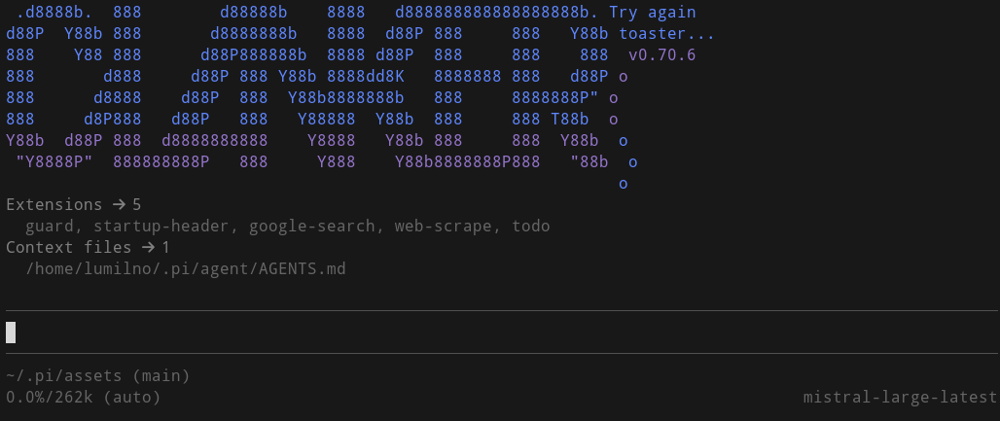

# My Pi agent config

The contents of my `~/.pi` directory used by the [Pi coding agent](https://github.com/davidondrej/pi-agent)

## Contents

This repo contains everything in my `~/.pi` directory with the omission of `~/.pi/agent/auth.json` and `~/.pi/agent/sessions` for obvious reasons (and other personal or WIP stuff where relevant). 

### Interesting(?) stuff

- `./agent/extensions/_unused-websearch.ts` contains my first try at a web search tool. It uses the Mistral API to call an agent with web search capabilities. Kind of terrible, since you can't force it to actually commit to a search, and it sometimes provides dead links and inaccurate summaries. Works but barely. 
- `./agent/extensions/web-search.ts` and `web-scrape.ts` use **Zyte** to first fetch Google results, then scrape the result contents. Works really well so far and doesn't cost _that_ much. I'm using Zyte over more popular alternatives for the same reason I use Mistral: fuck the eagle. 
- `.agent/extensions/stt.ts` uses Mistral's Voxtral model to transcribe audio files and speech. `/stt` slash command records voice for stt using ffmpeg and pulseaudio. Also uses xclip to copy to clipboard, so swap that out if you're not on an X11 environment. 

